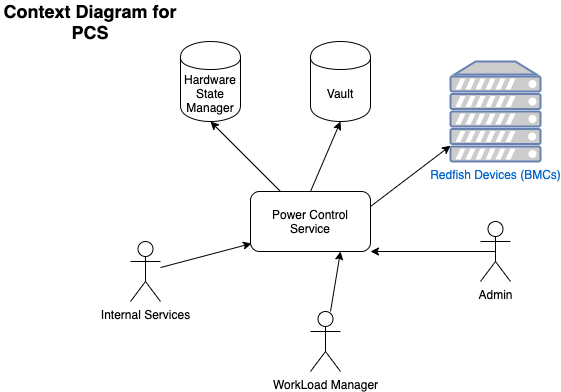
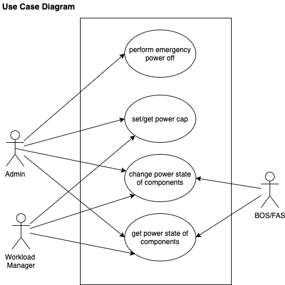

//TODO - create an architecture document?
* use cases
* context diagram
* design?

## Introduction to Power Control - Choosing the correct level of abstraction

The Power Control Service is a centralized software controls layer that abstracts the vendor specific implementations for hardware control of power.  We had many levels of hierarchy we could choose from to create PCS. 

 1. No abstraction - Base redfish access; would be very cumbersome for users as payloads and returns and methods would be different.  The API could be centralized (a proxy) but would offer no abstraction.
 2. Partial vendor abstraction, partial vendor revelation; this is pretty much what CAPMC looks like today.  The API is centralized; there is some base level of abstraction, but error handling and data encoding beyond the happy path looks more like wrapping the base data and returning it to the caller to digest. 
 3. Vendor abstraction and agnosticism.   This is the level of abstraction that PCS is aiming for. We have our own model of power states and transitions (the 'actions' that can be performed on hardware). We map the vendor implementation into our model and expose errors as they relate to our model.  The underlying implementation is hidden.  The caller ideally would be protected from the vendor oddities.  

### Control vs Orchestration 

PCS will be the source of truth for system power state, but is not the only actor that can influence power state.  The devices themselves can have their power state changed external to PCS (EPO, in-band /sbin/reboot, authorized redfish command, someone unplugging the device, etc).  PCS is not the sole legitmate actor to be able to change power state.  PCS will be the central API at the systems managment level to interface with power control, but we cannot act in a vaccum.   

PCS is a 'controls' level API vs an 'orchestration' level API.  That distinction may sound like semantics, but orchestration is a higher level of automation and influence. PCS abstracts the 'controls' of the system; but does not orchestrate higher order logic.  Other services may implement that higher order logic and build upon PCS as the building block.  A conversation we engaged in when designing PCS was whether or not to make PCS 'imperative' (go do this action) or 'declarative' (maintain this state).  PCS will be an imperative system by design.  Again because hardware is sensitive to failure and because there are other legitmate actors in the system PCS cannot maintain a 'declarative' hold on the power state of the system.  

## Context Diagram

## Use Case Diagram

## Stakeholders

### API

 * External Developers 
    * WLM -> Workload Managers 
 * Customer developers
    * Kraken -> LANL created declarative boot agent
 * HPE developers
    * BOS - Boot Orchestration Service, needs to boot nodes
    * FAS -> Firmware Action Service, has to reboot devices to perform firmware updates
    * SAT -> Shasta Admin Toolkit -> Relays power status and power control

### CLI

Administrators are primarily CLI stakeholder as that is how they will engage.  They are stakeholders in the API with relation to overall function, but not usability, because we address usability in the CLI. 

## Design Considerations

### CLI

Maybe The CLI can compensate for the group, partition, nid or host-list stuff?

### Alternative Considersations - Declarative vs Imperative

