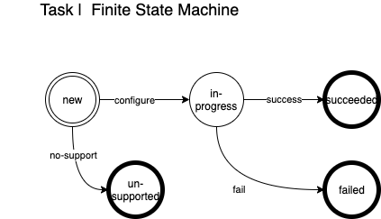

# Transitions

A `transition` is a request to transition a set of components via an operation.  Each operation has specific rules about what it can be applied to and what steps will be taken based on the state of the component.   Fundamentally a transition attempts to guarantee that an operation has been applied, not that the component is in a specific hardware state.  There are a few reasons for this:

1. Redfish has limited power states that are not universally supported.  They typical list of power states are:
   1. `on`
   2. `powering on`
   3. `off`
   4. `powering off`
2. a power state implies a point of time, and we can not guarantee that component states will remain fixed, that is beyond our control because of:
   1. hardware instability
   2. other actors
3. The desired behavior is really only measurable as part of a transition; `restart` or `force-off` are important 'transitions' but are not actually valid 'states'.

## PCS - Power transition map

| Operation | Description | Redfish Command | Redfish Condition |
| --- | --- | --- | --- |
| `on` | turns xname on only if the device state is off | `On` | xname must be in `Off` state |
| `off` | turns xname off only if the device state is on | `GracefulShutdown` -> `ForceOff` | xname must be in `On` state |
| `soft-restart` | restarts xname only if the device state is on; Does not necessarily drop the power.  | `GracefulRestart` -> then `ForceRestart` if not honored within a deadline or can figure out that it hasnt been honored; elif the command doesnt exist `GracefulShutdown` -> `ForceOff` followed by `On`| xname must be in `On` state |
| `hard-restart` | restarts xname only if the device state is on;  will definitely drop the power. |`GracefulShutdown` -> `ForceOff` -> `On` | xname must be in `On` state |
| `force-off` | turns xname off only if the device state is not specifically `Off` | `ForceOff` | xname must not be in `Off` state |
| `init` | guarantees that an `On` command will be experienced by the xname; will definitely drop the power. |`GracefulShutdown` -> `ForceOff` -> `On` | If the device is `On` already; it will issue `Off` -> `On`; If the device is `Off` -> it will issue an `On`. |
| `epo` | turns xname off; emergency power off; mountain chassis ONLY; This is really a separate API... but putting it here for completeness  | `ForceOff` | - |

## Terminology

 1. Reboot -> linux reboot; not be via redfish; `sudo shutdown -r now`; initiated on the running. We don't really have the ability to do this.  When you do a restart (graceful or otherwise) we send an ACPI reset, which gets sent to the kernel
 2. Restart -> redfish terminology; send ACPI to target node; to initiate a linux `Reboot`; `sudo shutdown -r now` 
 		3. Graceful - engages kernel
 		4. Forced - skips the kernel
 5. Re-init -> CAPMC terminology; we map this to a 'graceful restart' if thats not available; we do an 'off' then 'on' 
 1. power on - All power on does is provide the power to the system; it will follow the default boot params. Once we get to the 'boot' portion - CAPMC work is done.  
 2. boot - A 'boot' needs a correct config (an OS: PXE, HDD, etc), it takes the node to a running OS.  

### Some RFE requested behavior

1. Status that we (BOA) could check up on to see whether our request succeeded or failed or was still in progress.  
   1. Response: The API will provide a token to check on the status.  see `GET /transitions/{transitionID}`
2. An abstraction for power state, so we (BOA) didn’t have to care whether we were dealing with a Gigabyte node, an HPE node, or a Mountain node, etc.
   1. Response: We are working on this as well. We want to abstract the differences in RF devices by vendor, and in some case from model to model.  We have already standardized this for the transitions, but are still working on it for the pure power state information. 
3. A quality of service guarantee that says PCS will ensure that the request is performed. We would rather not receive a ‘200’ status code indicating that, “Yes, the message was delivered, but we really don’t know what the BMC did with it.”
   1. Response: Guarantee is a strong word; what we can do is provide a more useful API model where callers can see what's in flight, what worked, what failed.  We are working on an approach to help 'guarantee' that the desired transition will be accomplished, but ultimately the hardware may not always allow this. 

As part of our design we intend to:

* make `transitions` have retry logic;
* be more vendor agnostic in our data model
* handle errors in a more meaningful way; meaning that they are identified, standardized, and actionable (if possible)

### Transition

### Task
